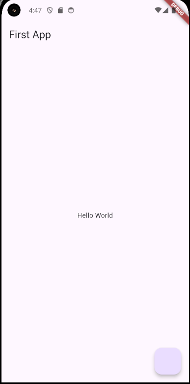
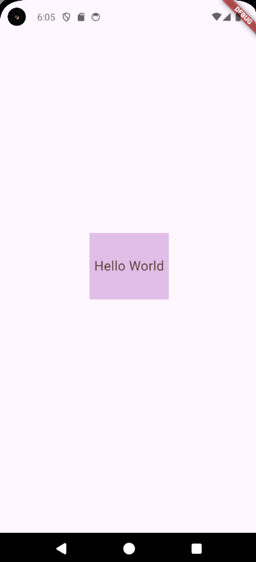
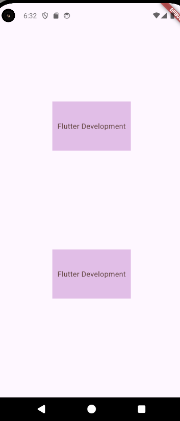
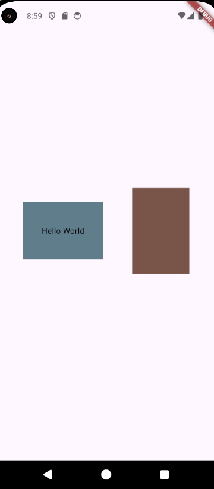
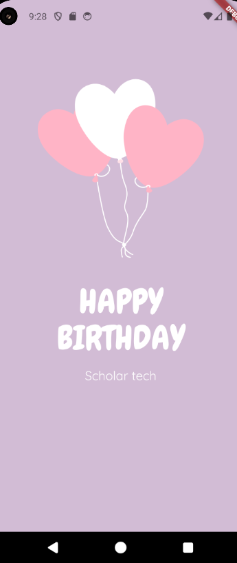
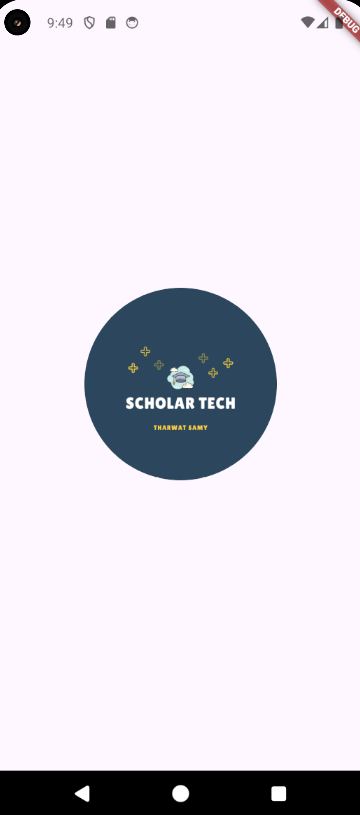
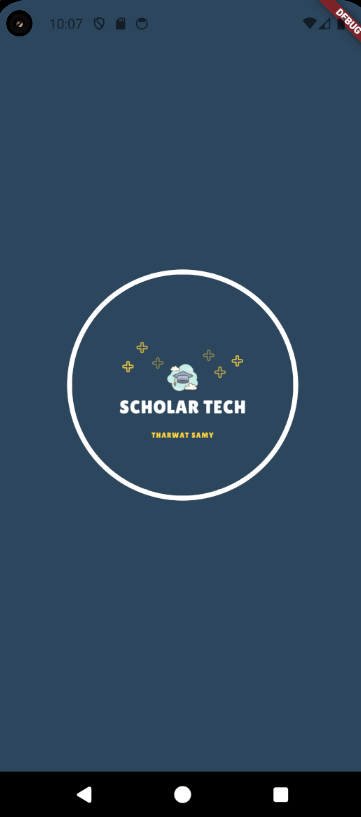
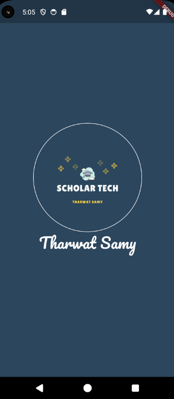
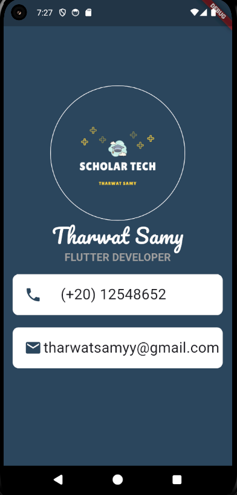
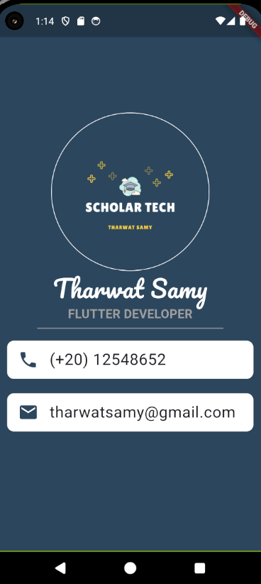

### Flutter
#### MaterialApp :
- contain widgets
#### Scaffold :
- apply style of materialApp
- ( floatingActionButton , appBar , body )
```
void main() {
  runApp(
    MaterialApp(
      home: Scaffold(
        floatingActionButton: FloatingActionButton(onPressed: () {},),
        appBar: AppBar(title: Text('First App'),),
        body: Center(child: Text('Hello World'),),
  )));
}
```


---
### Widgets :
- statefulW
- statelessW : new widget we create and assign name for it (custom widget)
```
void main() {
  runApp(HelloWorldApp());
}

class HelloWorldApp extends StatelessWidget {
  HelloWorldApp();   //constructor

  @override
  Widget build(BuildContext context) {
    return MaterialApp(
      home: Scaffold(
        body: Center(
          child: Text('First App'),
        ),
      ),
    );
  }
}
```


- hot reload : find nearest (build) method and apply changes has occurred, not run App from start .


---
### Container widget :
- TextStyle widget :
```
void main() {
  runApp(HelloWorldApp());
}

class HelloWorldApp extends StatelessWidget {
  HelloWorldApp();

  @override
  Widget build(BuildContext context) {
    return MaterialApp(
      home: Scaffold(
        body: Center(
          child: Container(
            height: 100,
            width: 120,
            color: Colors.purple[100],
            child: Center(
              child: Text(
                'Hello World',
                style: TextStyle(fontSize: 20, color: Colors.brown[700]),
              ),
            ),
          ),
        ),
      ),
    );
  }
}
```



---
### Column widget :
- Contain all containers
- Take width of bigger container
- Main axis => ( Y ) axis
- Cross axis => default ( center )
```
void main() {
  runApp(HelloWorldApp());
}

class HelloWorldApp extends StatelessWidget {
  HelloWorldApp();

  @override
  Widget build(BuildContext context) {
    return MaterialApp(
      home: Scaffold(
        body: Center(
          child: Column(
            // mainAxisSize: MainAxisSize.max,
            mainAxisAlignment: MainAxisAlignment.spaceEvenly,
            crossAxisAlignment: CrossAxisAlignment.center,
            children: [
              Container(
                height: 100,
                width: 160,
                color: Colors.purple[100],
                child: Center(
                  child: Text(
                    'Flutter Development',
                    style: TextStyle(fontSize: 15, color: Colors.brown[700]),
                  ),
                ),
              ),
              Container(
                height: 100,
                width: 160,
                color: Colors.purple[100],
                child: Center(
                  child: Text(
                    'Flutter Development',
                    style: TextStyle(fontSize: 15, color: Colors.brown[700]),
                  ),
                ),
              ),
            ],
          ),
        ),
      ),
    );
  }
}
```



---
### Row widget :
- Take height of bigger container
- Main axis => ( X ) axis
```
void main() {
  runApp(HelloWorldApp());
}

class HelloWorldApp extends StatelessWidget {
  HelloWorldApp();

  @override
  Widget build(BuildContext context) {
    return MaterialApp(
      home: Scaffold(
        body: Center(
          child: Row(
            mainAxisAlignment: MainAxisAlignment.spaceEvenly,
            crossAxisAlignment: CrossAxisAlignment.center,
            children: [
              Container(
                height: 100,
                width: 140,
                color: Colors.blueGrey,
                child: Center(
                  child: Text(
                    'Hello World',
                    style: TextStyle(color: Colors.black),
                  ),
                ),
              ),
              Container(
                height: 150,
                width: 100,
                color: Colors.brown,
              )
            ],
          ),
        ),
      ),
    );
  }
}
```



---
### Image :
- save image in 'pubspec.yaml' file ( assets ) before using it
- Colors : 
- ex:1
-         Colors.blueGray
- ex:2 
-         Color(0xff......)
```
void main() {
  runApp(HelloWorldApp());
}

class HelloWorldApp extends StatelessWidget {
  HelloWorldApp();

  @override
  Widget build(BuildContext context) {
    return MaterialApp(
      home: Scaffold(
        backgroundColor: Color(0XffD2BCD5),
        body: Image(
          image: AssetImage('images/birthday_card.png'),
        ),
      ),
    );
  }
}
```
- " or "
```
void main() {
  runApp(HelloWorldApp());
}

class HelloWorldApp extends StatelessWidget {
  HelloWorldApp();

  @override
  Widget build(BuildContext context) {
    return MaterialApp(
      home: Scaffold(
        backgroundColor: Color(0XffD2BCD5),
        body: Image.asset('images/birthday_card.png')
        ),
    );
  }
}
```



---
### Circle Image :
#### 1- ClipRRect :
- This clip the image with any shape, We detect the radius of the borders to make the shape of the image as we want
- Width => Size of the image
```
void main() {
  runApp(HelloWorldApp());
}

class HelloWorldApp extends StatelessWidget {
  HelloWorldApp();

  @override
  Widget build(BuildContext context) {
    return MaterialApp(
      home: Scaffold(
        body: Center(
          child: ClipRRect(
            borderRadius: BorderRadius.circular(999),
            child: Image.asset(
              'images/tharwat.png',
              width: 200,
            ),
          ),
        ),
      ),
    );
  }
}
```


#### 2- CircleAvatar :
- This clip the image as a circle, Put the image as a background, If we want to make a border, Put the border color as a CircleAvatar widget with radius bigger than the image
- Radius => Size of the image
```
void main() {
  runApp(HelloWorldApp());
}

class HelloWorldApp extends StatelessWidget {
  HelloWorldApp();

  @override
  Widget build(BuildContext context) {
    return MaterialApp(
      home: Scaffold(
        backgroundColor: Color(0Xff2B465D),
        body: Center(
          child: CircleAvatar(
            backgroundColor: Colors.white,
            radius: 120,
            child: CircleAvatar(
              backgroundImage: 
              AssetImage('images/tharwat.png'),
              radius: 115),
          ),
        ),
      ),
    );
  }
}
```



---
### Font Family :
- Save font family in 'pubspec.yaml' file ( Fonts ) before using it
```
void main() {
  runApp(HelloWorldApp());
}

class HelloWorldApp extends StatelessWidget {
  HelloWorldApp();

  @override
  Widget build(BuildContext context) {
    return MaterialApp(
      home: Scaffold(
        backgroundColor: Color(0Xff2B465D),
        body: Center(
          child: Column(
            mainAxisAlignment: MainAxisAlignment.center,
            crossAxisAlignment: CrossAxisAlignment.center,
            children: [
              CircleAvatar(
                backgroundColor: Colors.white,
                radius: 116,
                child: CircleAvatar(
                  backgroundImage: AssetImage('images/tharwat.png'),
                  radius: 115,
                ),
              ),
              Text(
                'Tharwat Samy',
                style: TextStyle(
                    fontSize: 32, fontFamily: 'Pacifico', color: Colors.white),
              ),
            ],
          ),
        ),
      ),
    );
  }
}
```



---
### Padding :
### Icon :
### Decoration :
### Box decoration :
### Spacer widget :
```
void main() {
  runApp(BusinessCardApp());
}

class BusinessCardApp extends StatelessWidget {
  BusinessCardApp();

  @override
  Widget build(BuildContext context) {
    return MaterialApp(
      home: Scaffold(
        backgroundColor: Color(0Xff2B465D),
        body: Center(
          child: Column(
            mainAxisAlignment: MainAxisAlignment.center,
            crossAxisAlignment: CrossAxisAlignment.center,
            children: [
              CircleAvatar(
                backgroundColor: Colors.white,
                radius: 116,
                child: CircleAvatar(
                  backgroundImage: AssetImage('images/tharwat.png'),
                  radius: 115,
                ),
              ),
              Text(
                'Tharwat Samy',
                style: TextStyle(
                    fontSize: 35, color: Colors.white, fontFamily: 'Pacifico'),
              ),
              Text(
                'FLUTTER DEVELOPER',
                style: TextStyle(
                    fontSize: 18,
                    color: Colors.grey[500],
                    fontWeight: FontWeight.bold),
              ),
              Padding(
                padding: EdgeInsets.all(16),
                child: Container(
                  decoration: BoxDecoration(
                      color: Colors.white,
                      borderRadius: BorderRadius.circular(10)),
                  height: 70,
                  child: Row(
                    children: [
                      Padding(padding: EdgeInsets.only(left: 20)),
                      Icon(Icons.phone, size: 30, color: Color(0Xff2B465D)),
                      Spacer(flex: 1),
                      Text(
                        '(+20) 12548652',
                        style: TextStyle(
                          fontSize: 25,
                        ),
                      ),
                      Spacer(flex: 3)
                    ],
                  ),
                ),
              ),
              Padding(
                padding: EdgeInsets.fromLTRB(16, 5, 16, 16),
                child: Container(
                  decoration: BoxDecoration(
                      color: Colors.white,
                      borderRadius: BorderRadius.circular(10)),
                  height: 70,
                  child: Row(
                    children: [
                      Padding(padding: EdgeInsets.only(left: 20)),
                      Icon(Icons.mail, size: 30, color: Color(0Xff2B465D)),
                      Spacer(flex: 1),
                      Text(
                        'tharwatsamyy@gmail.com',
                        style: TextStyle(
                          fontSize: 25,
                        ),
                      ),
                      Spacer(flex: 2)
                    ],
                  ),
                ),
              )
            ],
          ),
        ),
      ),
    );
  }
}
``` 



---
### Divider :
- indent
- endIndent
- thickness
### Margin :
- Space around main widget
- padding (widget) > space around widget inside = margin
- padding (attribute) > space around widget after
### Card :
### ListTile :
- leading
- title
- shape: RoundedRectangleBorder(borderRadius: BorderRadius.circular(value))
```
void main() {
  runApp(BusinessCardApp());
}

class BusinessCardApp extends StatelessWidget {
  BusinessCardApp();

  @override
  Widget build(BuildContext context) {
    return MaterialApp(
      home: Scaffold(
        backgroundColor: Color(0Xff2B465D),
        body: Center(
          child: Column(
            mainAxisAlignment: MainAxisAlignment.center,
            crossAxisAlignment: CrossAxisAlignment.center,
            children: [
              CircleAvatar(
                backgroundColor: Colors.white,
                radius: 116,
                child: CircleAvatar(
                  backgroundImage: AssetImage('images/tharwat.png'),
                  radius: 115,
                ),
              ),
              Text(
                'Tharwat Samy',
                style: TextStyle(
                    fontSize: 35, color: Colors.white, fontFamily: 'Pacifico'),
              ),
              Text(
                'FLUTTER DEVELOPER',
                style: TextStyle(
                    fontSize: 18,
                    color: Colors.grey[500],
                    fontWeight: FontWeight.bold),
              ),
              Divider(
                color: Colors.grey[500],
                thickness: 1,
                indent: 60,
                endIndent: 60,
              ),
              Card(
                margin: EdgeInsets.fromLTRB(16, 10, 16, 16),
                color: Colors.white,
                shape: RoundedRectangleBorder(
                    borderRadius: BorderRadius.circular(10)),
                child: ListTile(
                  leading: Icon(
                    Icons.phone,
                    size: 30,
                    color: Color(0Xff2B465D),
                  ),
                  title: Text(
                    '(+20) 12548652',
                    style: TextStyle(fontSize: 23),
                  ),
                ),
              ),
              Card(
                margin: EdgeInsets.fromLTRB(16, 5, 16, 16),
                color: Colors.white,
                shape: RoundedRectangleBorder(
                    borderRadius: BorderRadius.circular(10)),
                child: ListTile(
                  leading: Icon(
                    Icons.mail,
                    size: 30,
                    color: Color(0Xff2B465D),
                  ),
                  title: Text(
                    'tharwatsamy@gmail.com',
                    style: TextStyle(fontSize: 23),
                  ),
                ),
              )
            ],
          ),
        ),
      ),
    );
  }
}
```



---
### Const :
- a keyword used to define compile-time constants. It is used for values that are known at compile time and remain constant throughout the execution of the app. Using const can help with performance optimization, as the compiler can allocate memory for the constant values only once and reuse it
```
void main() {
  runApp(const BusinessCardApp());
}

class BusinessCardApp extends StatelessWidget {
  const BusinessCardApp({super.key});

  @override
  Widget build(BuildContext context) {
    return MaterialApp(
      home: Scaffold(
        backgroundColor: const Color(0Xff2B465D),
        body: Center(
          child: Column(
            mainAxisAlignment: MainAxisAlignment.center,
            crossAxisAlignment: CrossAxisAlignment.center,
            children: [
              const CircleAvatar(
                backgroundColor: Colors.white,
                radius: 116,
                child: CircleAvatar(
                  backgroundImage: AssetImage('images/tharwat.png'),
                  radius: 115,
                ),
              ),
              const Text(
                'Tharwat Samy',
                style: TextStyle(
                    fontSize: 35, color: Colors.white, fontFamily: 'Pacifico'),
              ),
              Text(
                'FLUTTER DEVELOPER',
                style: TextStyle(
                    fontSize: 18,
                    color: Colors.grey[500],
                    fontWeight: FontWeight.bold),
              ),
              Divider(
                color: Colors.grey[500],
                thickness: 1,
                indent: 60,
                endIndent: 60,
              ),
              Card(
                margin: const EdgeInsets.fromLTRB(16, 10, 16, 16),
                color: Colors.white,
                shape: RoundedRectangleBorder(
                    borderRadius: BorderRadius.circular(10)),
                child: const ListTile(
                  leading: Icon(
                    Icons.phone,
                    size: 30,
                    color: Color(0Xff2B465D),
                  ),
                  title: Text(
                    '(+20) 12548652',
                    style: TextStyle(fontSize: 23),
                  ),
                ),
              ),
              Card(
                margin: const EdgeInsets.fromLTRB(16, 5, 16, 16),
                color: Colors.white,
                shape: RoundedRectangleBorder(
                    borderRadius: BorderRadius.circular(10)),
                child: const ListTile(
                  leading: Icon(
                    Icons.mail,
                    size: 30,
                    color: Color(0Xff2B465D),
                  ),
                  title: Text(
                    'tharwatsamy@gmail.com',
                    style: TextStyle(fontSize: 23),
                  ),
                ),
              )
            ],
          ),
        ),
      ),
    );
  }
}
```